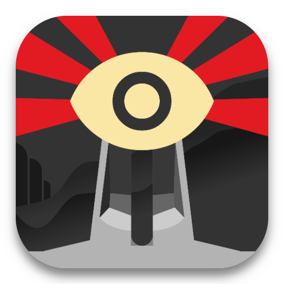
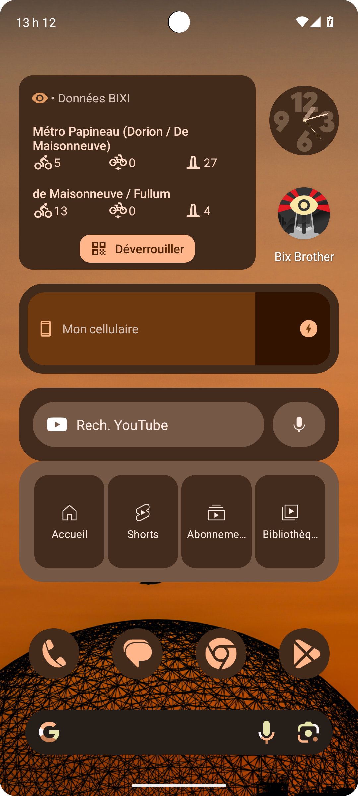
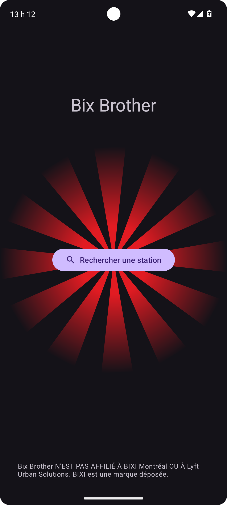
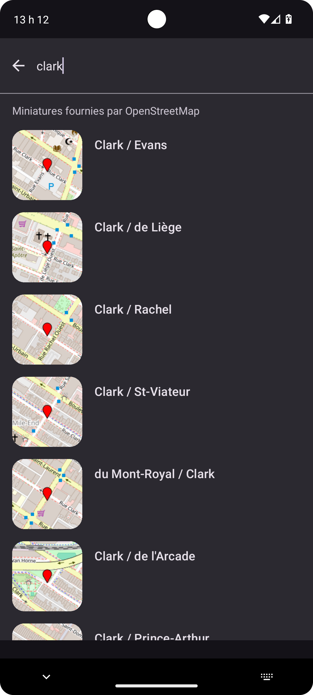

# Bix Brother

Do you spend your time opening the app to find out how many bikes are at the station around the corner from your block? Would you like to be able to check the occupancy rate of several stations at a glance? Bix Brother is watching for you 👀

> [!IMPORTANT]  
> Bix Brother IS NOT AFFILIATED WITH BIXI Montréal OR Lyft Urban Solutions. BIXI is a registered trademark.

## Screenshots

yeah that's Fr\*nch but dw the app has English i18n too ;)

## Scope and desirable improvements

- [x] Medium-sized widget that can show several stations
- [ ] Small widget that can show a single station but can be resized to odd shapes (e.g. vertical)
- [ ] Support for other bike-sharing services that have a [GBFS](https://gbfs.org/) feed
  - [ ] Support for importing bike-sharing services (name, logo, GBFS feed) based on their Wikidata node¹
  - [ ] Hybrid station tracking system that polls GBFS feeds directly from the cell phone, in case the backend doesn't know about a specific feed (we don't want to arbitrarily track any feed the users give us)
- [ ] Customizable per-widget title/alias for each station
- [ ] Laxer search system, smoother UI...

¹ Fun fact #1: As of september 2025, BIXI is the only bike sharing service (instance of Q1358919) to have a Wikidata node with a GBFS feed (though it's really easy to contribute other ones). Fun fact #2: BIXI's Wikidata node has ID 386, making it one of the very first elements to be added to Wikidata.

## Technical architecture

The station data is obtained using the [GBFS](https://gbfs.org/) data provided by BIXI.

Rather than constantly polling the 280Kb station status file — which is simultaneously resource-intensive and cannot be done reasonably fast enough to have up-to-date data — we sell our souls to Google and deliver station updates using Firebase Cloud Messaging's topic system. Basically, we have a backend that fetches the station statuses every 10 seconds (the advertised TTL of the station status file) and compares its entries' fill state with the previous ones. All changes are pushed to one FCM topic per station. On the client side, the app maintains subscriptions to every topic/station that's tracked by at least one widget on the home screen. This way, your phone only receives data messages when there's a change that's actually relevant to you. Due to how Android manages notifications, and the fact that these data notifications are marked as low-priority, it's very likely that the data messages are only polled when your phone is somewhat "active", meaning that it should use pretty much no power when you're not looking at it. The flip side is that this app is heavily reliant on Google's services — like virtually all other Android app that send notifications.

The back-end process uses [`go-staticmaps`](https://github.com/flopp/go-staticmaps) to generate OpenStreetMap thumbnails that are served to the app and aggressively cached.
